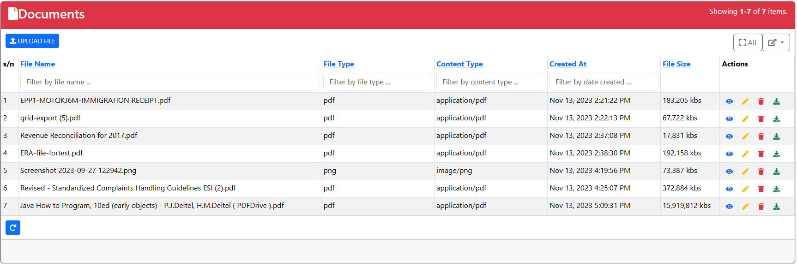
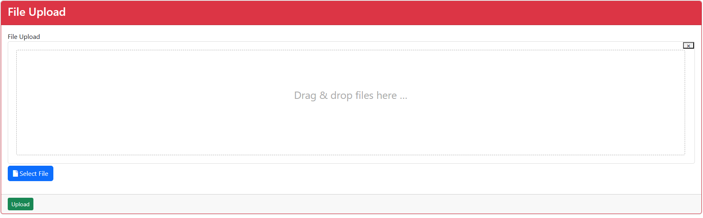
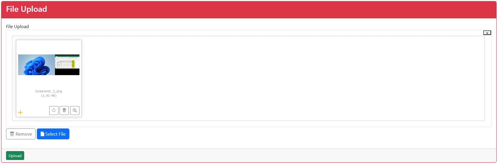
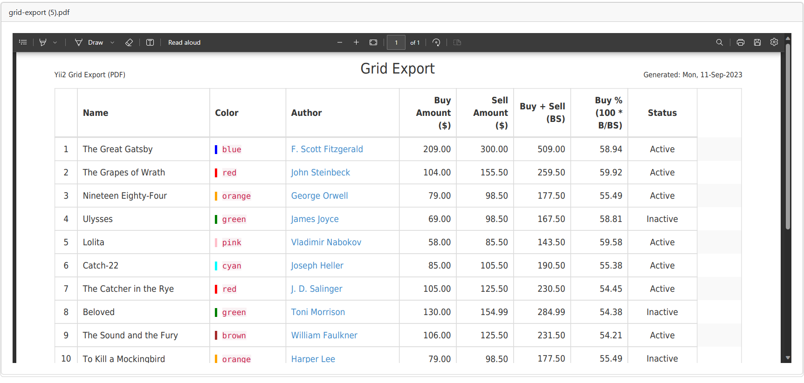

# yii2-file-upload
This repository demonstrates file upload including the CRUD operations.

For php developers using yii2, Here's an Interesting file upload that can come handy in your development.

Most developments in yii2 are acompanied with files' uploads.
Here is a yii2 application that demonstrates file uploads to a 'files' table including the CRUD operations.

## Things to lookout for before appending this folder into your application.
- After you have set your application, run the yii migrate to migrate the 'files' table into your database.
- Ensure that the migration module is at the root folder of your application.

## Additional Information:
This demonstration is based on kartik plugins and bootstrap version 5. 
Ensure you have the following in the require section in your composer.json file.

	"kartik-v/yii2-grid": "dev-master", "kartik-v/yii2-bootstrap5-dropdown": "^1.0", "kartik-v/yii2-widget-fileinput": "dev-master", "kartik-v/yii2-editors": "dev-master", "kartik-v/yii2-widget-activeform": "dev-master", "kartik-v/yii2-widgets": "^3.4", "kartik-v/yii2-date-range": "^1.7",

Thereafter run composer update to install and update the plugins required to successfully use the files' demonstration.

## Further developments.
Pre-loading the content of the uploaded file data to the fileInput is still a challenge. Anyone with any ideas please share.

## Screenshots demo
### The index page

### The upload&Update page

### The View page

